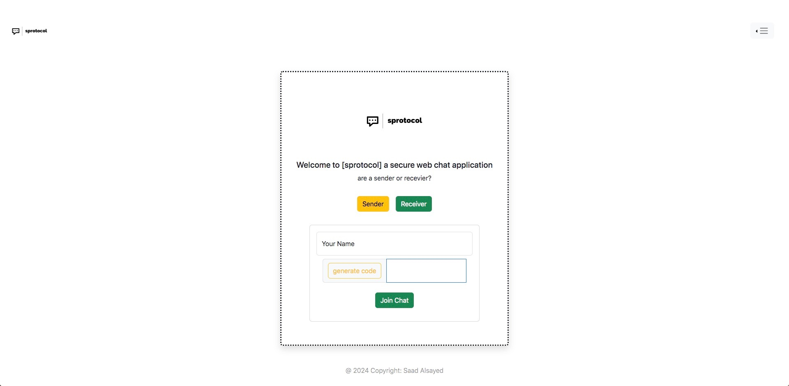

# sprotocol | سبرتكول -- This project is not completed yet.

- a secure web chat application using a secure hash code password sent by [Sender] to [Recevier], to initiate the connection.

  # Built with
  - Front-end (HTML, CSS, Js, React.js, Bootstrap)
  - Back-end (Python, Flask, SQl Alchemy)

- Screenshots:

Sender page -> the user can generate a secure code and copy the code and send it to recevier and join the chat

Recevier page -> the user can paste the copied secure code and join the chat

Chat page:

